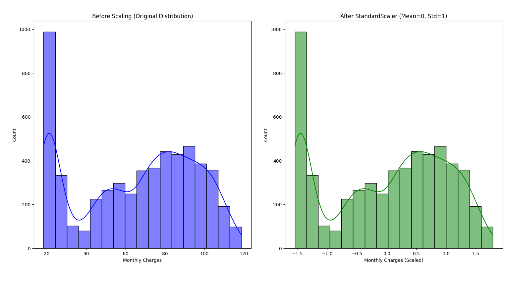
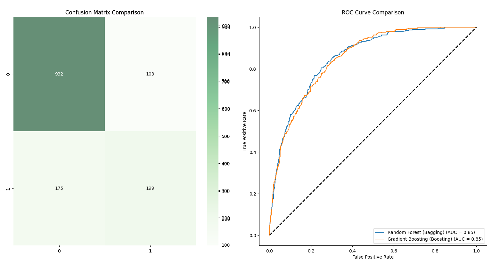

# Project

## Overview
This document contains the recorded terminal output generated by running
the implementation of **Telco customer churn project**.

## Execution Details
- **Language:** Python 3.12
- **Virtual Environment:** `fisEnv`
- **Script:** `project/src/project.py`
- **Working Directory:** `FIS4041_F_40121723_40115563`

### Command Used
```bash
python project/src/project.py
```

## Terminal Output
```
--- Step 1: Data Introduction & Loading ---
Data Loaded Successfully.

Shape of dataset: (7043, 33)

Data Types:
str        23
int64       6
float64     3
object      1
Name: count, dtype: int64

Target Distribution (Churn Value):
Churn Value
0    0.73463
1    0.26537
Name: proportion, dtype: float64

--- Step 2: Data Preprocessing & Effect Analysis ---

--- Step 3: Dimensionality Reduction (PCA) & Cost-Benefit Analysis ---
Original Features: 30
Features after PCA (95% Variance): 17

Running quick comparison: PCA vs. No-PCA (using Random Forest)...
Method          | Training Time (s)  | Accuracy
--------------------------------------------------
Original        | 0.1337             | 0.7956
With PCA        | 0.1198             | 0.7963

--- Step 4 & 5: Model Selection (Bagging vs Boosting) & Hyperparameter Tuning ---

Training Random Forest (Bagging) with GridSearchCV...
Fitting 5 folds for each of 12 candidates, totalling 60 fits
Best Params for Random Forest (Bagging): {'max_depth': 10, 'min_samples_split': 2, 'n_estimators': 100}
Best CV F1-Score: 0.8588

Training Gradient Boosting (Boosting) with GridSearchCV...
Fitting 5 folds for each of 8 candidates, totalling 40 fits
Best Params for Gradient Boosting (Boosting): {'learning_rate': 0.1, 'max_depth': 3, 'n_estimators': 50}
Best CV F1-Score: 0.8632

--- Step 6 & 7: Final Evaluation, Reproducibility & Visualization ---

==================== Random Forest (Bagging) Evaluation ====================
              precision    recall  f1-score   support

           0       0.93      0.69      0.79      1035
           1       0.50      0.87      0.63       374

    accuracy                           0.73      1409
   macro avg       0.72      0.78      0.71      1409
weighted avg       0.82      0.73      0.75      1409


==================== Gradient Boosting (Boosting) Evaluation ====================sdkfjs
              precision    recall  f1-score   support

           0       0.88      0.80      0.84      1035
           1       0.56      0.71      0.62       374

    accuracy                           0.77      1409
   macro avg       0.72      0.75      0.73      1409
weighted avg       0.80      0.77      0.78      1409


Generating Learning Curves for Gradient Boosting (Best Model Analysis)...
```

## Visualizations

### Visualization of preprocessing effect 


### Confusion Matrix and ROC Curve comparison


### Learning Curve for Gradient Boosting
.png)